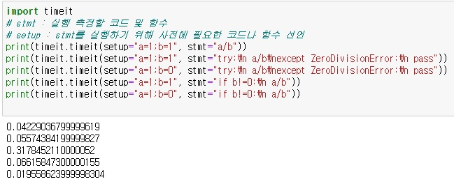

# Python_exception
참고사이트  
: https://gomguard.tistory.com/122  
: https://smecsm.tistory.com/166  

# **예외**  
- 문장이나 표현식이 문법적으로 올바르더라도 실행 중 에러리를 일으킬 수 있는데 이러한 에러들을 예외라고 합니다.  

---  

# **예외 발생 시**  
- 파이썬은 오류가 발생하면 프로그램을 중단시키고 오류 메시지를 보여줍니다.  

---  

# **예외 처리 기법**  
**1. try, except, else, finally문**
```python
try :
  실행시킬 코드0
except [발생오류1 [as 오류변수1]]:
  실행시킬 코드1
except [발생오류2 [as 오류변수2]]:
  pass
else :
  실행시킬 코드 2
finally :
  f.close()
```  

- try 블록 수행 중 오류 발생 : except문 + finally문 실행합니다.  
- try 블록 수행 중 오류 발생 x : else문 + finally문 실행합니다.  
- finally문은 try문의 오류 발생 유무와 상관없이 실행합니다.  

**2. 오류 회피**  
- pass : 아무 작업도 하지 않고 다음으로 넘겨버립니다.  

**3. 오류 발생시키기**
- 프로그램 작성 목적에 맞게 오류를 발생시켜야 하는 경우가 발생합니다.  
```python
# 나이를 입력받는 상황에서 음수를 기입하는 경우
try :
  age = int(input())
  if age <= 0:
    raise NotImplementedError
  print(f'나이는 {age}살입니다.')
except NotImplementedError :
  print('NotImplementedError!')
```  

**4. 사용자 정의 오류**  
- 파이썬의 Exception 클래스를 상속해서 오류를 생성할 수 있습니다.
``` python
class AgeError(Exception):
  def __init__(self, msg='init_error_msg'):
    self.msg = msg

  def __str__(self):
    return self.msg

age = int(input())
if age <= 0:
  raise AgeError('r_error_msg')
print(f'나이는 {age}입니다.')
```  

---  

### try문에서 else문을 사용하는 이유  
**1. 성능**  
- try문 내부에서 수행되는 코드는 try문 외부에서 수행되는 코드에 비해 상대적으로 느립니다.
- 실행시간 측정  
  

> ㄱ.no error checking  ㄴ.try no error  ㄷ.try error  ㄹ.if no error  ㅁ.if error  
> ㅁ(0.019..) < ㄱ(0.042..) <  ㄴ(0.055..) < ㄹ(0.066..) < ㄷ(0.317..)  
> 정리하면 
> 시간 순 : if error문 < None < try no error문 < if no error문 < try error문  
> 성능 순 : if error문 > None > try no error문 > if no error문 > try error문  

**2. 의도의 명확성 & 가독성**  
- try문 : 에러가 발생할 가능성이 있으므로 예의주시해야 하는 코드라는 의미를 가진 코드입니다.  
- except문 : try문에서 기술한 코드에서 코드에서 발생할 수 있는 에러를 처리하는 부분을 의미하는 코드입니다.  

```python
try :
  result a/b
  return result
except ZeroDivisionError:
  print("ZeroDivisionError!")
```  
-> 여기에서 return result는 에러가 발생할 가능성이 있는 부분이 아니라 결과에 해당합니다.  
- 실질적으로 에러가 발생할 가능성이 있는 부분은 result = a/b이므로 return result는 try문이 아니라 else에 작성하는 것이 의도를 더 명확하게 하는 코드입니다.
